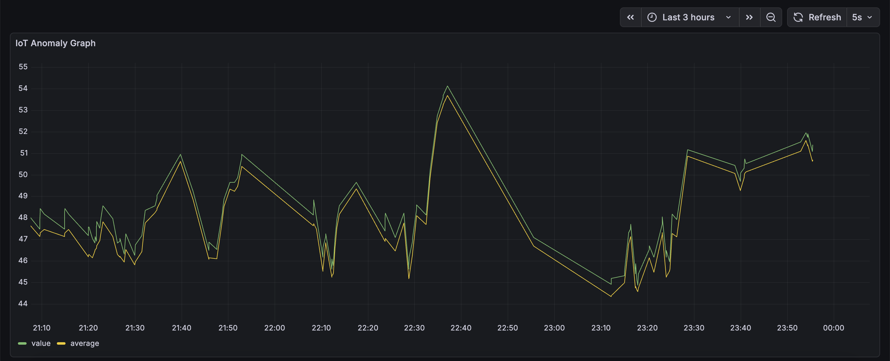

# 🏭 IoT Real-Time Anomaly Detection Pipeline

An end-to-end data engineering solution implementing a **Medallion Architecture** to monitor industrial vibration sensors. This project leverages **Kafka** for high-throughput streaming and **3-Sigma Statistical Analysis** to detect mechanical anomalies in real-time.

---

## 🏗 System Architecture

The pipeline follows the industry-standard Medallion data pattern to ensure scalability and data quality:

* **Bronze (Raw):** A Python producer simulates high-frequency vibration telemetry and streams raw JSON events into a Kafka topic.
* **Silver (Validated):** A stream processor consumes raw events, calculates rolling averages and standard deviations, and flags statistical outliers.
* **Gold (Enriched):** A storage worker persists critical anomaly alerts into a SQLite database for long-term audit and historical analysis.
* **Visualization:** A live **Grafana** dashboard visualizes sensor health, real-time vibration levels, and anomaly triggers.

---

## 🧪 The Math: 3-Sigma Anomaly Detection

To distinguish between normal operational noise and potential equipment failure, the Silver layer applies a **Z-Score/3-Sigma calculation**. An anomaly is defined as any data point ($x$) that deviates from the rolling mean ($\mu$) by more than three times the standard deviation ($\sigma$):

$$\text{Anomaly Trigger} \iff |x - \mu| > 3\sigma$$

Using a rolling window allows the system to adapt to shifting operational baselines, ensuring high precision in outlier detection.

---

## 🛠 Tech Stack

* **Streaming:** Apache Kafka (Confluent Platform)
* **Containerization:** Docker & Docker Compose (V2)
* **Language:** Python 3.9 (pandas, numpy, confluent-kafka)
* **Database:** SQLite 3
* **Observability:** Grafana
* **CI/CD:** GitHub Actions (Automated Build Verification)

---

## 🚦 Quick Start

### 1. Prerequisites
* Docker and Docker Compose (V2) installed on your machine.

### 2. Launch the Pipeline
Clone the repository and run the following command to build and start the entire stack:
**docker compose up -d --build**

### 3. Access the Dashboard
* **Grafana:** http://localhost:3000
* **Credentials:** admin / admin
* **Setup:** Go to Dashboards > Import and upload the **grafana/dashboard.json** file included in this repository.

---

## 📂 Project Structure

* **producer.py**: Bronze-layer sensor simulation.
* **processor.py**: Silver-layer real-time anomaly detection logic.
* **storage_worker.py**: Gold-layer database persistence.
* **grafana/**: Contains exported dashboard JSON for easy replication.
* **.github/workflows/**: CI/CD pipeline for automated Docker build verification.
* **data/**: Mounted volume for persistent SQLite storage (excluded from Git).

---

## ✅ CI/CD Status
This project uses **GitHub Actions** to perform a continuous integration check. On every push to the **main** branch, the system automatically verifies that the Docker images build correctly, ensuring the repository remains in a "ready-to-deploy" state.
